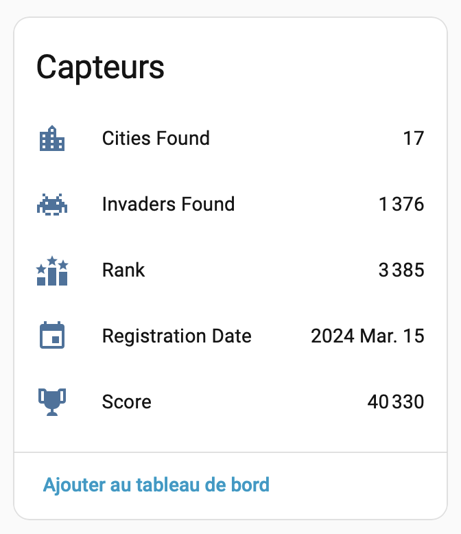
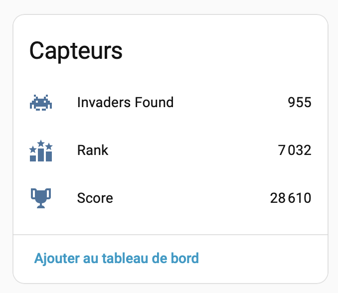
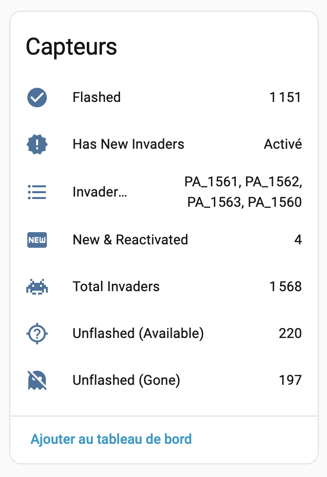

# Invader Tracker for Home Assistant

[](https://github.com/hacs/integration)
[](https://github.com/Trolent/HA-Invader-Tracker/releases)
[](LICENSE)
[](https://github.com/Trolent/HA-Invader-Tracker)
[](https://buymeacoffee.com/trolent)

Track [Space Invader](https://www.space-invaders.com/) street art mosaics in Home Assistant. This integration combines data from:

- **[invader-spotter.art](https://www.invader-spotter.art/)** - Community database of all known invaders with status updates
- **Flash Invader API** - Your personal flashed invaders via your account UID

## Overview

Invader Tracker is a comprehensive Home Assistant integration that helps you track, manage, and hunt Space Invader street art mosaics across multiple cities. It automatically monitors new additions, tracks destroyed invaders, and keeps you updated on your collection progress.

## Features

✨ **Core Features:**
- **Multi-city tracking** - Monitor invaders across any number of cities
- **Collection management** - Track which invaders you've flashed vs remaining targets
- **Smart notifications** - Get alerted to new invaders and reactivated targets
- **Missed opportunities** - Keep tabs on destroyed invaders you couldn't reach
- **Player profile device** - Your score, rank, cities found, and invaders found in one place
- **Followed players** - Track the players you follow directly in Home Assistant
- **Automation-ready** - Binary sensors and attributes for custom automations
- **Smart caching** - Efficient data fetching to minimize API calls
- **Status tracking** - Monitor invader condition (OK, damaged, destroyed, etc.)

🎯 **Advanced Features:**
- Real-time news aggregation from invader-spotter.art
- Automatic status change detection
- Invader first-seen date tracking
- Per-city device grouping for better organization
- Configurable update intervals for both scraping and API polling
- Fallback mechanisms and automatic retry on network errors

## Installation

### HACS (Recommended)

1. Open HACS in Home Assistant
2. Click on **Integrations**
3. Click the three dots in the top right corner
4. Select **Custom repositories**
5. Add `https://github.com/Trolent/HA-Invader-Tracker` with category **Integration**
6. Click **Install**
7. Restart Home Assistant

### Manual Installation

1. Download the latest release from [GitHub Releases](https://github.com/Trolent/HA-Invader-Tracker/releases)
2. Extract and copy `custom_components/invader_tracker` to your `config/custom_components/` directory
3. Restart Home Assistant

## Quick Start

1. Go to **Settings** → **Devices & Services**
2. Click **+ Add Integration** and search for "Invader Tracker"
3. Enter your Flash Invader UID
4. Select cities to track
5. Configure update intervals as needed

### Finding Your Flash Invader UID

Your UID is a unique identifier (UUID v4 format) for your Flash Invader account. To locate it:

**Method 1: Network Inspection**
1. Set up a network proxy tool (like mitmproxy, Charles Proxy, or Fiddler)
2. Configure your phone to use the proxy
3. Open the Flash Invader app and refresh your gallery
4. Look for API requests to `api.space-invaders.com`
5. Find the `uid` query parameter in the request URL
6. Format: `XXXXXXXX-XXXX-XXXX-XXXX-XXXXXXXXXXXX`

**Method 2: App Debugging**
1. Enable developer mode on your phone
2. Use Android Studio (Android) or Xcode (iOS) debugging tools
3. Monitor network traffic during app usage

⚠️ **Security Note:** Keep your UID private - it grants access to your Flash Invader account. Never share it publicly.

## Entities & Sensors

### Player Profile Device

Created automatically as soon as a UID is configured. The device is named **"Invader Tracker - {your pseudo}"**.

| Entity | Type | Description | Attributes |
|--------|------|-------------|------------|
| `sensor.score` | Sensor | Your total score | — |
| `sensor.rank` | Sensor | Your global rank | `rank_str` |
| `sensor.invaders_found` | Sensor | Total invaders flashed (all cities) | — |
| `sensor.cities_found` | Sensor | Number of cities with at least one flash | — |
| `sensor.registration_date` | Sensor | Account registration date | — |



### Followed Player Devices

One device per followed player, named **"Invader Tracker - {name}"**. Can be disabled in integration options.

| Entity | Type | Description | Attributes |
|--------|------|-------------|------------|
| `sensor.score` | Sensor | Player's total score | — |
| `sensor.rank` | Sensor | Player's global rank | `rank_str` |
| `sensor.invaders_found` | Sensor | Player's total invaders flashed | — |



### City Devices

For each tracked city, the integration creates a **device** with the following entities:

| Entity | Type | Description | Attributes |
|--------|------|-------------|------------|
| `sensor.total_invaders` | Sensor | Total invaders in the city | `flashable_count` |
| `sensor.flashed` | Sensor | Invaders you've flashed | — |
| `sensor.unflashed_available` | Sensor | Flashable invaders not yet done | — |
| `sensor.unflashed_gone` | Sensor | Destroyed invaders you missed | — |
| `sensor.new_reactivated` | Sensor | New + reactivated invaders (total) | `new_count`, `reactivated_count` |
| `sensor.invaders_to_flash` | Sensor | CSV list of IDs to flash | — |
| `binary_sensor.has_new` | Binary Sensor | ON when new invaders exist | — |



## Configuration Options

### Integration Settings

| Option | Type | Default | Description |
|--------|------|---------|-------------|
| **Cities** | Multi-select | None | Cities to track (required) |
| **Scrape Interval** | Dropdown | 24 hours | How often to check invader-spotter.art |
| **API Interval** | Dropdown | 1 hour | How often to check your Flash Invader data |
| **News Days** | Dropdown | 30 days | How many days of news history to track |
| **Track followed players** | Toggle | Enabled | Create devices and sensors for players you follow. Disable to skip the extra API call and hide followed player entities. |

### Recommended Settings

- **Daily hunters:** Scrape: 6-12 hours, API: 1 hour, News: 30 days
- **Weekly hunters:** Scrape: 24 hours, API: 6 hours, News: 30-60 days
- **Low bandwidth:** Scrape: 168+ hours, API: 12-24 hours, News: 7-14 days

## Automations

### Notify on New Invaders

```yaml
automation:
  - alias: "Alert: New Invaders Detected"
    description: "Notify when new invaders appear in tracked cities"
    trigger:
      - platform: state
        entity_id: binary_sensor.invader_paris_has_new
        to: "on"
    condition: []
    action:
      - service: notify.mobile_app_your_phone
        data:
          title: "🎨 New Space Invaders in Paris!"
          message: >
            {{ states('sensor.invader_paris_new') }} new invaders detected.
            IDs: {{ state_attr('sensor.invader_paris_new', 'invader_ids') | join(', ') }}
          data:
            tag: "invader-alert"
            color: "FF6B00"
```

### Daily Summary Report

```yaml
automation:
  - alias: "Invader Tracker: Daily Summary"
    description: "Send daily hunting status at 8 PM"
    trigger:
      - platform: time
        at: "20:00:00"
    action:
      - service: notify.mobile_app_your_phone
        data:
          title: "📊 Daily Invader Summary"
          message: |
            Paris: {{ states('sensor.invader_paris_unflashed') }} to flash ({{ states('sensor.invader_paris_flashed') }} done)
            Lyon: {{ states('sensor.invader_lyon_unflashed') }} to flash ({{ states('sensor.invader_lyon_flashed') }} done)
```

### Track Progress

```yaml
automation:
  - alias: "Invader Tracker: Milestone Alerts"
    description: "Alert when milestones are reached"
    trigger:
      - platform: numeric_state
        entity_id: sensor.invader_paris_flashed
        above: 50
    condition: []
    action:
      - service: notify.mobile_app_your_phone
        data:
          title: "🏆 Milestone Reached!"
          message: "Congratulations! You've flashed 50+ invaders in Paris!"
```

## Troubleshooting

### Integration Shows "Unavailable"

**Check these items in order:**

1. **Verify network connectivity**
   - Ensure Home Assistant can reach the internet
   - Test: `ping invader-spotter.art` and `ping space-invaders.com`

2. **Check integration logs**
   - Go to **Settings** → **System** → **Logs**
   - Filter by `custom_components.invader_tracker`
   - Look for connection or parsing errors

3. **Verify data source status**
   - Check if [invader-spotter.art](https://www.invader-spotter.art/) is accessible
   - Check if Flash Invader API is responsive
   - Try manually visiting the websites

### "Authentication Failed" Error

**Solutions:**
1. Your UID may have expired or changed
2. Re-obtain your UID from the Flash Invader app
3. Go to **Settings** → **Devices & Services** → Invader Tracker
4. Click the three dots → **Edit** → Update your UID
5. Restart Home Assistant if changes don't take effect

### Data Not Updating

**Check:**
1. **Last update timestamp** - Look at sensor attributes for `last_updated`
2. **Update interval** - Verify in integration options if too long
3. **Rate limiting** - Check logs for "Rate limited" warnings (wait before retrying)
4. **Service status** - invader-spotter.art may have temporary issues

### "No Cities Found" During Setup

**Causes and fixes:**
1. invader-spotter.art website structure may have changed
2. Network connectivity issue preventing city list fetch
3. Try again after a few minutes
4. Check [GitHub Issues](https://github.com/Trolent/HA-Invader-Tracker/issues) for known problems

### Enable Debug Logging

**Add to `configuration.yaml`:**

```yaml
logger:
  logs:
    custom_components.invader_tracker: debug
    homeassistant.components.invader_tracker: debug
```

Then check **Settings** → **System** → **Logs** for detailed output.

### Performance Issues

**If Home Assistant is slow:**
1. Increase scrape interval (slower but less load)
2. Reduce number of tracked cities
3. Check Home Assistant system logs for other issues
4. Monitor CPU/Memory during integration updates

## Contributing

We welcome contributions! Whether you're fixing bugs, adding features, or improving documentation:

1. Fork the repository
2. Create a feature branch (`git checkout -b feature/amazing-feature`)
3. Make your changes
4. Run tests (if applicable)
5. Commit with clear messages (`git commit -m 'Add amazing feature'`)
6. Push to your fork and submit a Pull Request

### Code Standards

- Follow PEP 8 style guidelines
- Include docstrings for functions and classes
- Add type hints where applicable
- Test your changes before submitting

### Reporting Issues

Please include:
- Home Assistant version
- Integration version
- What you were trying to do
- Error messages from logs
- Steps to reproduce

## Project Structure

```
├── custom_components/
│   └── invader_tracker/
│       ├── api/                    # External API clients
│       │   ├── flash_invader.py    # Flash Invader API (gallery, account, highscore)
│       │   └── invader_spotter.py  # Scraper for invader-spotter.art
│       ├── coordinator.py          # Data update coordinators
│       ├── processor.py            # Data processing & analysis
│       ├── models.py               # Data models & enums
│       ├── sensor.py               # City sensor entities
│       ├── sensor_profile.py       # Player profile & followed players sensors
│       ├── binary_sensor.py        # Binary sensor entities
│       ├── config_flow.py          # Configuration UI
│       ├── exceptions.py           # Custom exceptions
│       └── const.py                # Constants
├── tests/                          # Unit tests
└── docs/                           # Documentation
```

## Support & Credits

### Support This Project

If you find this integration valuable, consider supporting continued development:

[](https://buymeacoffee.com/trolent)

### Acknowledgments

- 🎨 **Space Invader** - The original street art project by Invader
- 🌐 **invader-spotter.art** - Community database and news source
- 📱 **Flash Invader** - Mobile app for tracking personal achievements
- 🏠 **Home Assistant** - Open-source home automation platform

### Data Sources

- Real-time invader data from [invader-spotter.art](https://www.invader-spotter.art/)
- Personal collection data via Flash Invader API
- News and updates from invader-spotter.art community

## License

This project is licensed under the **MIT License** - see the [LICENSE](LICENSE) file for details.

## Disclaimer

⚠️ **Important:**

- This integration is **not affiliated with** Space Invader, Flash Invader app, or invader-spotter.art
- Use responsibly and respect the terms of service for all data sources
- Always get permission before accessing private property
- This tool is provided as-is for personal use only
- Authors are not responsible for misuse or any consequences
