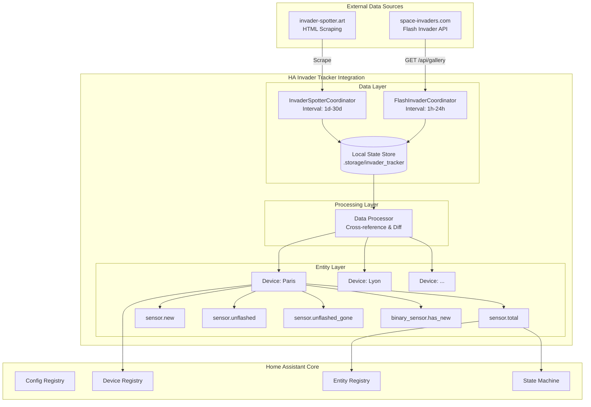
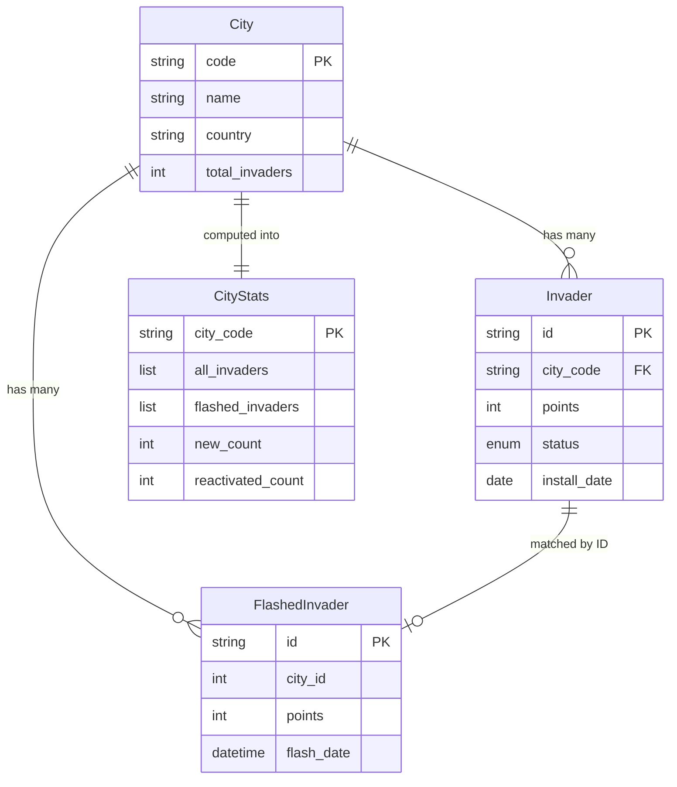
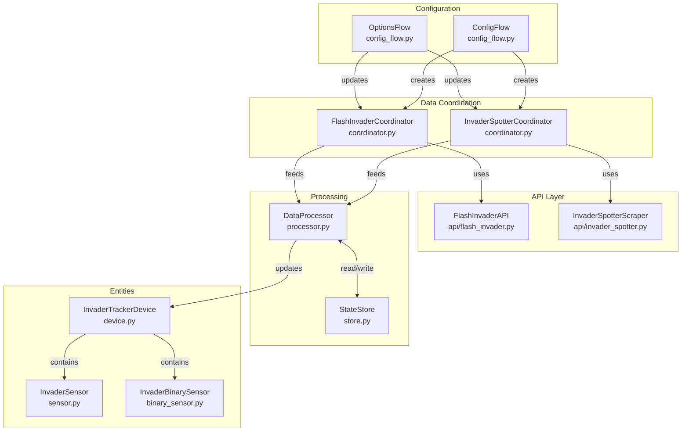
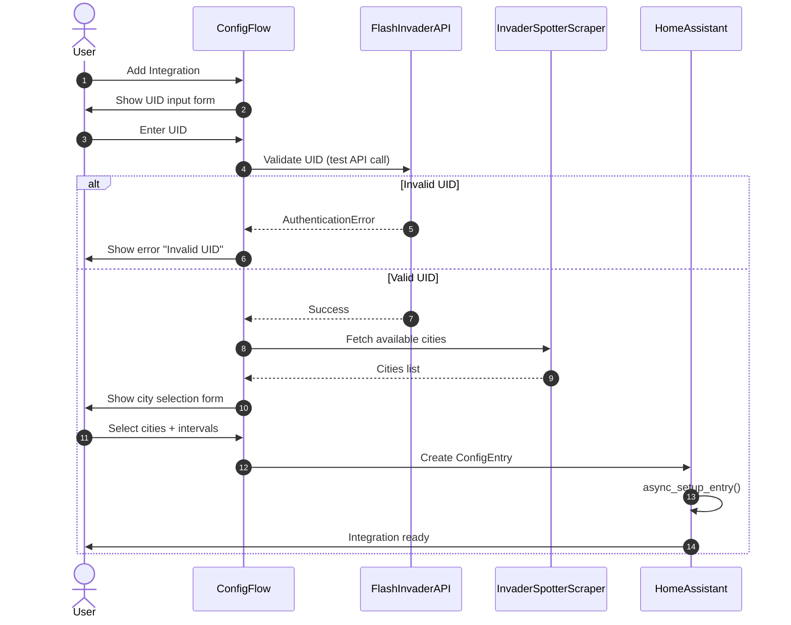
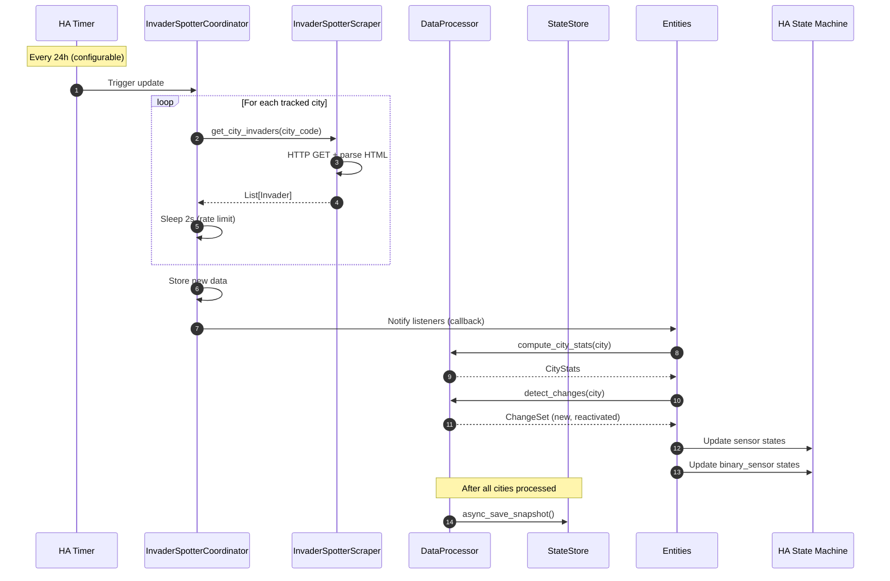
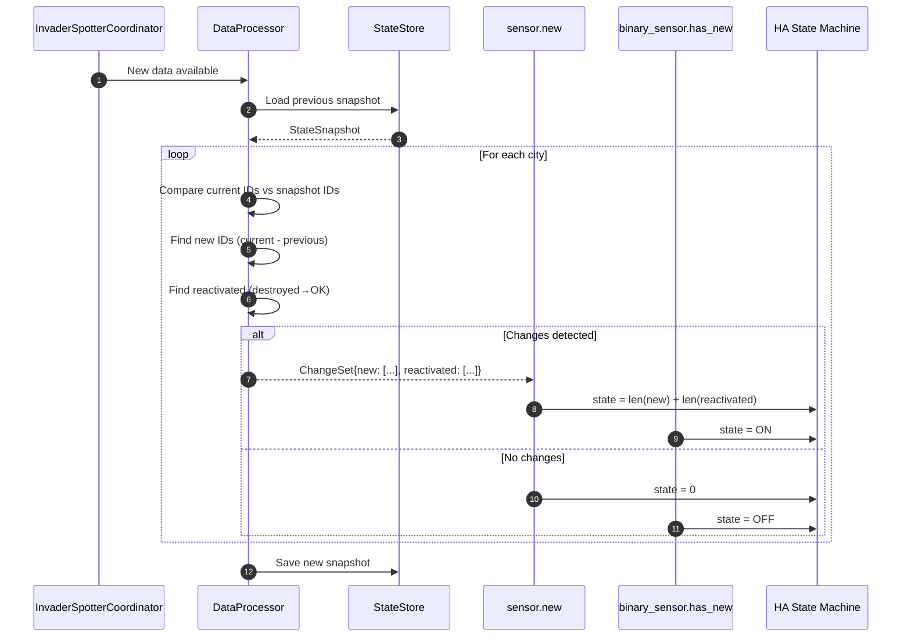

# HA Invader Tracker - Architecture Document

> **Version:** 1.0.0
> **Last Updated:** 2026-01-23
> **Status:** Ready for Implementation

---

## Table of Contents

1. [Introduction](#1-introduction)
2. [High-Level Architecture](#2-high-level-architecture)
3. [Tech Stack](#3-tech-stack)
4. [Data Models](#4-data-models)
5. [External APIs](#5-external-apis)
6. [Components](#6-components)
7. [Core Workflows](#7-core-workflows)
8. [Project Structure](#8-project-structure)
9. [Development Workflow](#9-development-workflow)
10. [CI/CD & Release](#10-cicd--release)
11. [Security](#11-security)
12. [Error Handling](#12-error-handling)
13. [Monitoring & Logging](#13-monitoring--logging)
14. [Architecture Checklist](#14-architecture-checklist)

---

## 1. Introduction

This document defines the complete architecture for the **HA Invader Tracker** custom integration for Home Assistant. The integration tracks Space Invader street art mosaics by combining data from two sources:

1. **Flash Invader API** (space-invaders.com) - User's personal flashed invaders via UID
2. **Invader-Spotter** (invader-spotter.art) - Community database of all known invaders with status

The integration exposes **devices per tracked city**, each containing sensors for tracking new, reactivated, and unflashed invaders - enabling Home Assistant automations for street art hunters.

### Project Type

**HACS Custom Integration** - Python-based, follows Home Assistant Core conventions, distributable via HACS.

### Key Requirements

| Requirement | Implementation |
|-------------|----------------|
| Daily scraping of invader-spotter | DataUpdateCoordinator with configurable interval |
| Flash Invader API polling | Separate coordinator, up to hourly |
| City filtering | Config flow with multi-select from discovered cities |
| Device per city | HA Device Registry with sensors grouped |
| Track new/reactivated | Compare against stored state |
| Track unflashed (flashable vs gone) | Cross-reference both data sources |

---

## 2. High-Level Architecture

### Technical Summary

The HA Invader Tracker is a **polling-based custom integration** built on Home Assistant's `DataUpdateCoordinator` pattern. It maintains two data pipelines: one for scraping the community invader-spotter.art database (configurable: daily to monthly), and another for querying the user's personal Flash Invader data via reverse-engineered API (up to hourly). Data is cross-referenced by invader ID to compute flash status, then exposed as Device entities per tracked city with multiple sensors. All state is persisted locally to enable detection of new/reactivated invaders between updates.

### Architecture Diagram



### Architectural Patterns

| Pattern | Application | Rationale |
|---------|-------------|-----------|
| **DataUpdateCoordinator** | Both data sources | HA-standard for polling; handles rate limiting, error retry, and entity updates automatically |
| **Repository Pattern** | API clients | Abstracts data fetching; enables mocking for tests and future API changes |
| **Observer Pattern** | Entity updates | Coordinators notify entities on data refresh; standard HA pattern |
| **Diff-based State** | New/reactivated detection | Store previous state, compare on update to detect changes |
| **Config Flow** | User setup | UI-based configuration; required for HACS distribution |
| **Device Grouping** | Per-city organization | Groups related sensors; enables per-city enable/disable |

### Data Flow

```
1. Config Flow → User enters UID + selects cities
2. InvaderSpotterCoordinator → Scrapes all invaders for selected cities
3. FlashInvaderCoordinator → Fetches user's flashed invaders
4. Data Processor → Cross-references by ID, computes:
   - total: All invaders in city (from invader-spotter)
   - flashed: Invaders user has flashed (from Flash Invader API)
   - unflashed: total - flashed (where status = OK/flashable)
   - unflashed_gone: total - flashed (where status = destroyed/unflashable)
   - new: Invaders not in previous state snapshot
5. Entities → Expose counts as state, lists as attributes
```

---

## 3. Tech Stack

### Core Technologies

| Category | Technology | Version | Purpose | Rationale |
|----------|------------|---------|---------|-----------|
| **Language** | Python | 3.12+ | Integration code | HA Core requirement (2024.x+) |
| **Framework** | Home Assistant Core | 2024.1+ | Integration platform | Target platform |
| **Async HTTP** | aiohttp | 3.9+ | API calls & scraping | HA's standard async HTTP client |
| **HTML Parsing** | BeautifulSoup4 | 4.12+ | Scrape invader-spotter | Industry standard, handles malformed HTML |
| **Data Validation** | voluptuous | 0.14+ | Config validation | HA's standard validation library |
| **Type Hints** | Python typing | 3.12+ | Type safety | HA code quality requirement |

### Development & Testing

| Category | Technology | Version | Purpose |
|----------|------------|---------|---------|
| **Testing** | pytest | 8.0+ | Unit & integration tests |
| **Async Testing** | pytest-asyncio | 0.23+ | Async test support |
| **HA Mocking** | pytest-homeassistant-custom-component | latest | HA-specific fixtures |
| **HTTP Mocking** | aioresponses | 0.7+ | Mock API responses |
| **Linting** | ruff | 0.2+ | Code linting |
| **Type Checking** | mypy | 1.8+ | Static type analysis |
| **Pre-commit** | pre-commit | 3.6+ | Git hooks |

### Dependencies (manifest.json)

```json
{
  "domain": "invader_tracker",
  "name": "Invader Tracker",
  "version": "1.0.0",
  "documentation": "https://github.com/username/ha-invader-tracker",
  "issue_tracker": "https://github.com/username/ha-invader-tracker/issues",
  "dependencies": [],
  "codeowners": ["@username"],
  "requirements": [
    "beautifulsoup4>=4.12.0"
  ],
  "iot_class": "cloud_polling",
  "config_flow": true
}
```

---

## 4. Data Models

### Core Data Structures

```python
from dataclasses import dataclass, field
from datetime import date, datetime
from enum import Enum
from typing import Optional, List


class InvaderStatus(Enum):
    """Status from invader-spotter community data."""
    OK = "ok"                    # Intact, flashable
    DAMAGED = "damaged"          # Partially damaged, may be flashable
    DESTROYED = "destroyed"      # Gone, unflashable
    UNKNOWN = "unknown"          # No recent report


@dataclass
class Invader:
    """Represents an invader from invader-spotter.art."""
    id: str                      # e.g., "PA_346", "LYN_042"
    city_code: str               # e.g., "PA", "LYN"
    city_name: str               # e.g., "Paris", "Lyon"
    points: int                  # Point value (10-100)
    install_date: Optional[date] # Date de pose
    status: InvaderStatus        # Current known status
    status_date: Optional[date]  # When status was last reported
    status_source: Optional[str] # Who reported (e.g., "spott", "user")

    @property
    def is_flashable(self) -> bool:
        """Can this invader still be flashed?"""
        return self.status in (InvaderStatus.OK, InvaderStatus.DAMAGED)


@dataclass
class FlashedInvader:
    """Represents an invader the user has flashed."""
    id: str                      # e.g., "PA_346"
    name: str                    # Same as ID typically
    city_id: int                 # Numeric city ID from API
    points: int                  # Points earned
    image_url: str               # URL to invader image
    install_date: date           # date_pos from API
    flash_date: datetime         # When user flashed it


@dataclass
class City:
    """Represents a city with invaders."""
    code: str                    # e.g., "PA", "LYN"
    name: str                    # e.g., "Paris", "Lyon"
    country: str                 # e.g., "France"
    total_invaders: int          # Count from invader-spotter
    api_city_id: Optional[int] = None  # Numeric ID from Flash Invader API


@dataclass
class CityStats:
    """Computed statistics for a tracked city."""
    city: City
    all_invaders: List[Invader] = field(default_factory=list)
    flashed_invaders: List[FlashedInvader] = field(default_factory=list)

    @property
    def flashed_ids(self) -> set[str]:
        return {inv.id for inv in self.flashed_invaders}

    @property
    def unflashed(self) -> List[Invader]:
        """Invaders not flashed AND still flashable."""
        return [inv for inv in self.all_invaders
                if inv.id not in self.flashed_ids and inv.is_flashable]

    @property
    def unflashed_gone(self) -> List[Invader]:
        """Invaders not flashed AND no longer flashable (missed)."""
        return [inv for inv in self.all_invaders
                if inv.id not in self.flashed_ids and not inv.is_flashable]

    @property
    def total_count(self) -> int:
        return len(self.all_invaders)

    @property
    def flashed_count(self) -> int:
        return len(self.flashed_invaders)

    @property
    def unflashed_count(self) -> int:
        return len(self.unflashed)

    @property
    def unflashed_gone_count(self) -> int:
        return len(self.unflashed_gone)


@dataclass
class StateSnapshot:
    """Snapshot of state for detecting changes."""
    timestamp: datetime
    invader_ids_by_city: dict[str, set[str]]
    status_by_invader: dict[str, InvaderStatus]

    def get_new_invaders(self, city_code: str, current_ids: set[str]) -> set[str]:
        """Return IDs that are in current but not in snapshot."""
        previous = self.invader_ids_by_city.get(city_code, set())
        return current_ids - previous

    def get_reactivated(self, current_invaders: List[Invader]) -> List[Invader]:
        """Return invaders whose status changed from destroyed to OK."""
        reactivated = []
        for inv in current_invaders:
            prev_status = self.status_by_invader.get(inv.id)
            if prev_status == InvaderStatus.DESTROYED and inv.status == InvaderStatus.OK:
                reactivated.append(inv)
        return reactivated
```

### Data Relationships



---

## 5. External APIs

### Flash Invader API (space-invaders.com)

**Purpose:** Retrieve the user's personal list of flashed invaders

| Property | Value |
|----------|-------|
| **Base URL** | `https://space-invaders.com` |
| **Documentation** | None (reverse-engineered) |
| **Authentication** | UID header (UUID format) |
| **Rate Limits** | Unknown (assume conservative: 24 req/day safe) |

#### Endpoint: Get User's Flashed Invaders

```http
GET /flashinvaders_v3_pas_trop_predictif/api/gallery HTTP/1.1
Host: space-invaders.com
Accept: */*
User-Agent: HomeAssistant/InvaderTracker
uid: {user_uid}
Origin: https://pnote.eu
Referer: https://pnote.eu/
```

#### Response Format

```json
{
  "invaders": {
    "PA_346": {
      "image_url": "https://space-invaders.com/media/invaders/paris/PA_346-276F6UKS.jpg",
      "point": 20,
      "city_id": 1,
      "name": "PA_346",
      "space_id": 346,
      "date_pos": "2000-10-01",
      "date_flash": "2025-02-08 17:18:20"
    }
  }
}
```

#### Field Mapping

| API Field | Data Model Field | Type |
|-----------|------------------|------|
| `key` (dict key) | `FlashedInvader.id` | string |
| `name` | `FlashedInvader.name` | string |
| `city_id` | `FlashedInvader.city_id` | int |
| `point` | `FlashedInvader.points` | int |
| `image_url` | `FlashedInvader.image_url` | string |
| `date_pos` | `FlashedInvader.install_date` | date |
| `date_flash` | `FlashedInvader.flash_date` | datetime |

### Invader-Spotter (invader-spotter.art)

**Purpose:** Scrape community database of all known invaders with status

| Property | Value |
|----------|-------|
| **Base URL** | `https://www.invader-spotter.art` |
| **Documentation** | None (HTML scraping) |
| **Authentication** | None required |
| **Rate Limits** | Be respectful - max 1 full scrape/day |

#### Endpoints

- **Cities List:** `GET /villes.php`
- **City Invaders:** `GET /ville.php?ville={city_code}`

#### HTML Structure to Parse

```html
<div class="invader">
  <a href="invader.php?id=BRL_01">BRL_01</a> [20 pts]<br>
  Date de pose : 10/05/2002<br>
  Dernier état connu : <span class="status-ok">OK</span><br>
  Date et source : août 2018 (spott)<br>
</div>
```

#### Status Mapping

| French Text | InvaderStatus | Flashable |
|-------------|---------------|-----------|
| `OK` | `OK` | Yes |
| `Dégradé` / `Abîmé` | `DAMAGED` | Yes |
| `Détruit` / `Disparu` | `DESTROYED` | No |
| `Inconnu` / missing | `UNKNOWN` | Unknown |

---

## 6. Components

### Component Diagram



### Component Responsibilities

| Component | File | Responsibility |
|-----------|------|----------------|
| **ConfigFlow** | `config_flow.py` | User setup wizard (UID + city selection) |
| **OptionsFlow** | `config_flow.py` | Reconfigure cities/intervals |
| **InvaderSpotterCoordinator** | `coordinator.py` | Periodic scraping of invader-spotter |
| **FlashInvaderCoordinator** | `coordinator.py` | Periodic Flash Invader API calls |
| **FlashInvaderAPI** | `api/flash_invader.py` | API client for space-invaders.com |
| **InvaderSpotterScraper** | `api/invader_spotter.py` | HTML scraper for invader-spotter.art |
| **DataProcessor** | `processor.py` | Cross-reference data, compute stats, detect changes |
| **StateStore** | `store.py` | Persist state snapshots to HA storage |
| **InvaderSensor** | `sensor.py` | Sensor entities (counts with list attributes) |
| **InvaderBinarySensor** | `binary_sensor.py` | Binary sensor (has_new trigger) |

---

## 7. Core Workflows

### Initial Setup (Config Flow)



### Scheduled Data Refresh



### New Invader Detection



---

## 8. Project Structure

```
ha-invader-tracker/
├── .github/
│   ├── workflows/
│   │   ├── ci.yaml                    # Lint, type check, test on PR
│   │   ├── release.yaml               # Build & publish on tag
│   │   └── hacs.yaml                  # HACS validation
│   └── ISSUE_TEMPLATE/
│
├── custom_components/
│   └── invader_tracker/
│       ├── __init__.py                # Integration setup & lifecycle
│       ├── manifest.json              # HA + HACS metadata
│       ├── const.py                   # Constants, defaults, keys
│       ├── config_flow.py             # UI configuration wizard
│       ├── coordinator.py             # DataUpdateCoordinators
│       ├── processor.py               # Data cross-referencing logic
│       ├── store.py                   # State persistence
│       ├── sensor.py                  # Sensor entities
│       ├── binary_sensor.py           # Binary sensor entities
│       ├── device.py                  # Device info helper
│       ├── models.py                  # Data models (dataclasses)
│       ├── exceptions.py              # Custom exceptions
│       ├── api/
│       │   ├── __init__.py
│       │   ├── flash_invader.py       # Flash Invader API client
│       │   └── invader_spotter.py     # Invader-Spotter scraper
│       ├── strings.json               # UI strings (English)
│       └── translations/
│           ├── en.json
│           └── fr.json
│
├── tests/
│   ├── conftest.py                    # Pytest fixtures
│   ├── test_config_flow.py
│   ├── test_coordinator.py
│   ├── test_processor.py
│   ├── test_sensor.py
│   └── fixtures/
│       ├── flash_invader_response.json
│       └── invader_spotter_paris.html
│
├── docs/
│   └── architecture.md                # This document
│
├── .gitignore
├── .pre-commit-config.yaml
├── hacs.json
├── LICENSE
├── README.md
├── requirements.txt
├── requirements_dev.txt
└── pyproject.toml
```

---

## 9. Development Workflow

### Initial Setup

```bash
# Clone repository
git clone https://github.com/username/ha-invader-tracker.git
cd ha-invader-tracker

# Create virtual environment
python -m venv venv
source venv/bin/activate

# Install dependencies
pip install -r requirements.txt
pip install -r requirements_dev.txt

# Install pre-commit hooks
pre-commit install
```

### Development Commands

```bash
# Linting
ruff check .
ruff format --check .

# Type checking
mypy custom_components/invader_tracker

# Run tests
pytest

# Run tests with coverage
pytest --cov=custom_components/invader_tracker --cov-report=html

# Format code
ruff format .
ruff check --fix .
```

### Local Testing with Home Assistant

```bash
# Symlink to HA installation
ln -s $(pwd)/custom_components/invader_tracker \
      ~/.homeassistant/custom_components/invader_tracker

# Or use Docker
docker run -d \
  -v $(pwd)/custom_components:/config/custom_components \
  -p 8123:8123 \
  homeassistant/home-assistant:latest
```

---

## 10. CI/CD & Release

### GitHub Actions Workflows

#### CI Pipeline (`.github/workflows/ci.yaml`)

- **lint:** Ruff linting and formatting check
- **type-check:** MyPy static analysis
- **test:** Pytest with coverage
- **hacs-validate:** HACS validation action

#### Release Pipeline (`.github/workflows/release.yaml`)

Triggered on version tags (`v*.*.*`):
1. Verify manifest version matches tag
2. Create zip archive
3. Generate changelog from PRs
4. Create GitHub Release with assets

### Release Process

```bash
# Update version in manifest.json
# Commit and push
git add custom_components/invader_tracker/manifest.json
git commit -m "Bump version to 1.1.0"
git push origin main

# Create and push tag
git tag v1.1.0
git push origin v1.1.0

# GitHub Actions automatically creates release
```

---

## 11. Security

### Credential Management

- **UID Storage:** Stored in HA's ConfigEntry (encrypted at rest on HA OS)
- **UID in Transit:** Sent via HTTPS header only
- **UID Logging:** Never logged, never in entity attributes

### Security Checklist

| Category | Check | Status |
|----------|-------|--------|
| **Credentials** | UID stored in ConfigEntry | ✅ |
| **Credentials** | UID never logged | ✅ |
| **Network** | All requests over HTTPS | ✅ |
| **Network** | SSL verification enabled | ✅ |
| **Input** | UID format validated | ✅ |
| **Input** | City codes validated | ✅ |
| **Rate Limiting** | Self-imposed delays | ✅ |

---

## 12. Error Handling

### Exception Hierarchy

```python
class InvaderTrackerError(Exception):
    """Base exception."""

class AuthenticationError(InvaderTrackerError):
    """UID invalid or expired."""

class ConnectionError(InvaderTrackerError):
    """Network connection failed."""

class ParseError(InvaderTrackerError):
    """Failed to parse response."""

class RateLimitError(InvaderTrackerError):
    """Rate limited by external service."""
```

### Error Recovery Strategies

| Error Type | Recovery Strategy | User Impact |
|------------|-------------------|-------------|
| **Auth Failed** | Trigger reauth flow | Notification |
| **Rate Limited** | Exponential backoff | Temporary unavailable |
| **Connection Timeout** | Retry next interval | Use cached data |
| **Parse Error (partial)** | Skip bad entries | Slightly stale data |
| **All Cities Failed** | Mark unavailable | Entities unavailable |

---

## 13. Monitoring & Logging

### Diagnostic Sensors

| Entity | Type | Purpose |
|--------|------|---------|
| `sensor.invader_tracker_status` | Diagnostic | ok/error with details |
| `sensor.invader_tracker_last_update` | Diagnostic | Last success timestamp |
| `sensor.invader_tracker_cities_scraped` | Diagnostic | Count of cities with data |

### Enable Debug Logging

```yaml
# configuration.yaml
logger:
  default: warning
  logs:
    custom_components.invader_tracker: debug
```

### Health Check Service

```yaml
# Developer Tools > Services
service: invader_tracker.health_check
# Returns connectivity status for both APIs
```

---

## 14. Architecture Checklist

### Requirements Traceability

| Requirement | Status |
|-------------|--------|
| Scrape invader-spotter.art daily | ✅ |
| Use personal UID for Flash Invader API | ✅ |
| Track new/reactivated invaders | ✅ |
| Track unflashed invaders (flashable) | ✅ |
| Track unflashed invaders (gone) | ✅ |
| Filter by city in settings | ✅ |
| Device per city | ✅ |
| Expose as HA entities | ✅ |
| HACS distributable | ✅ |

### Entity Summary

| Entity Pattern | Type | State | Attributes |
|----------------|------|-------|------------|
| `sensor.invader_{city}_total` | Sensor | Count | List of IDs |
| `sensor.invader_{city}_flashed` | Sensor | Count | IDs + dates |
| `sensor.invader_{city}_unflashed` | Sensor | Count | IDs + points |
| `sensor.invader_{city}_unflashed_gone` | Sensor | Count | IDs |
| `sensor.invader_{city}_new` | Sensor | Count | New + reactivated |
| `binary_sensor.invader_{city}_has_new` | Binary | ON/OFF | Count |

### Implementation Estimate

| Phase | Components | Effort |
|-------|------------|--------|
| **Phase 1: Core** | Models, API clients, coordinator | ~2 days |
| **Phase 2: Integration** | Config flow, entities, device | ~2 days |
| **Phase 3: Processing** | DataProcessor, StateStore | ~1 day |
| **Phase 4: Polish** | Diagnostics, translations | ~1 day |
| **Phase 5: Release** | Tests, CI/CD, docs | ~2 days |

---

## Appendix: File Templates

### hacs.json

```json
{
  "name": "Invader Tracker",
  "homeassistant": "2024.1.0",
  "render_readme": true,
  "zip_release": true,
  "filename": "invader_tracker.zip"
}
```

### pyproject.toml

```toml
[project]
name = "ha-invader-tracker"
version = "1.0.0"
requires-python = ">=3.12"

[tool.ruff]
target-version = "py312"
line-length = 100

[tool.ruff.lint]
select = ["E", "W", "F", "I", "UP", "B", "C4", "ASYNC"]

[tool.mypy]
python_version = "3.12"
strict = true

[tool.pytest.ini_options]
testpaths = ["tests"]
asyncio_mode = "auto"
```

---

*Document generated by Winston, BMAD Architect Agent*
