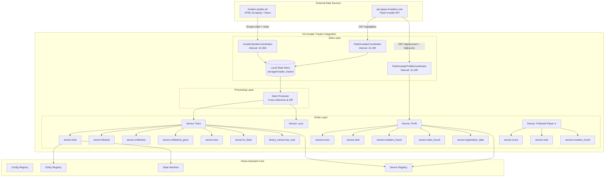
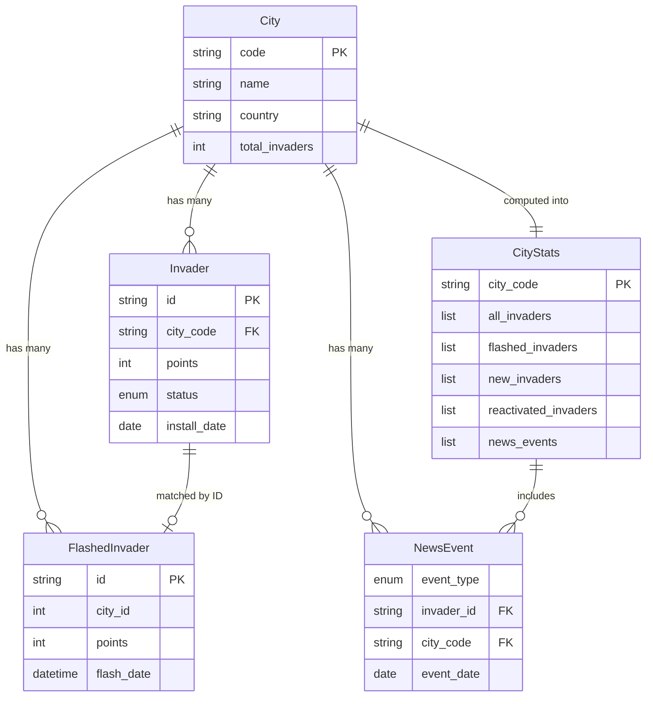
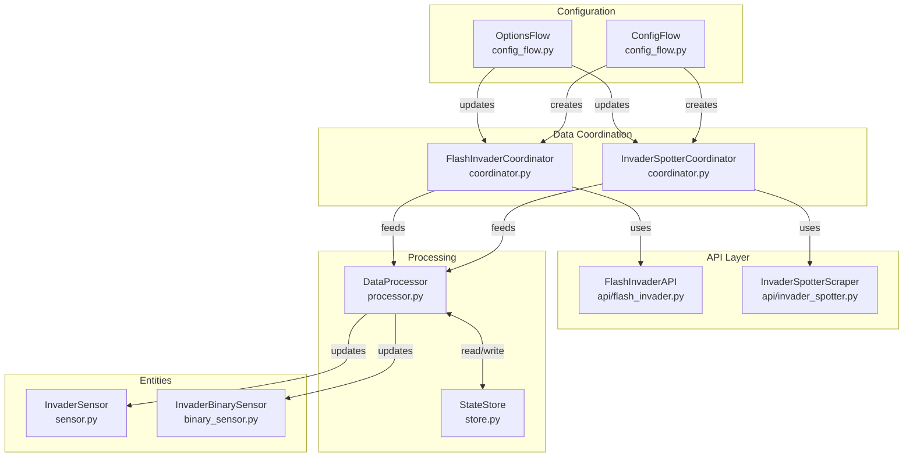
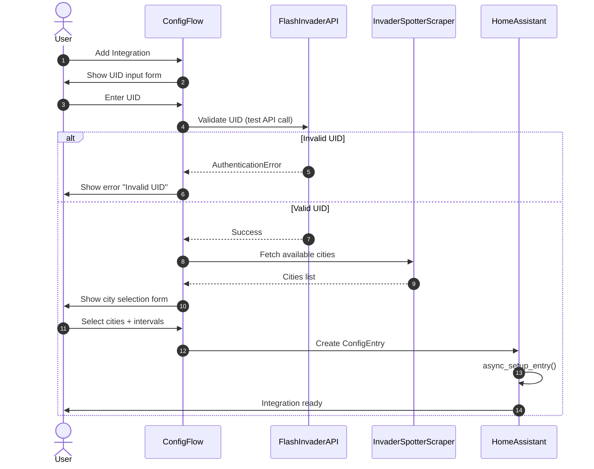
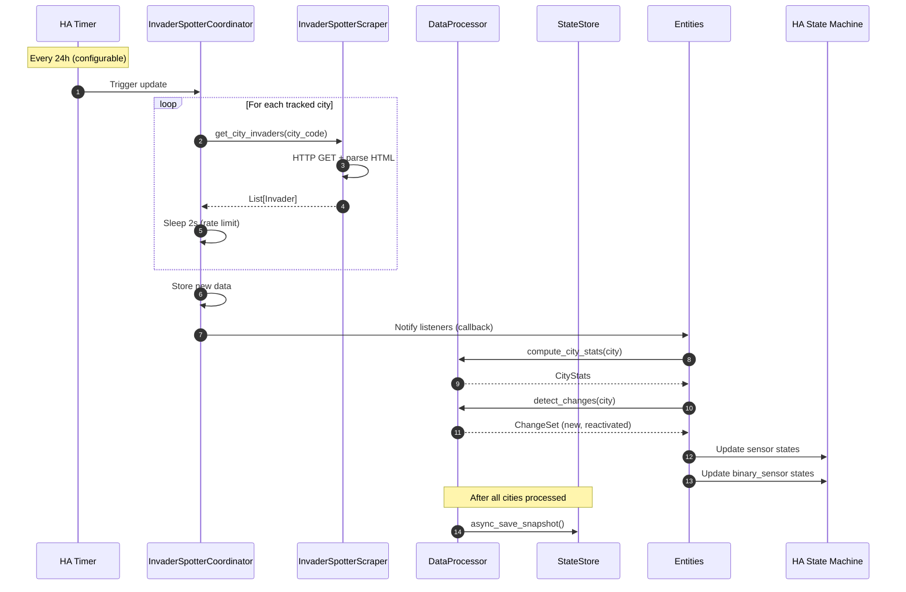
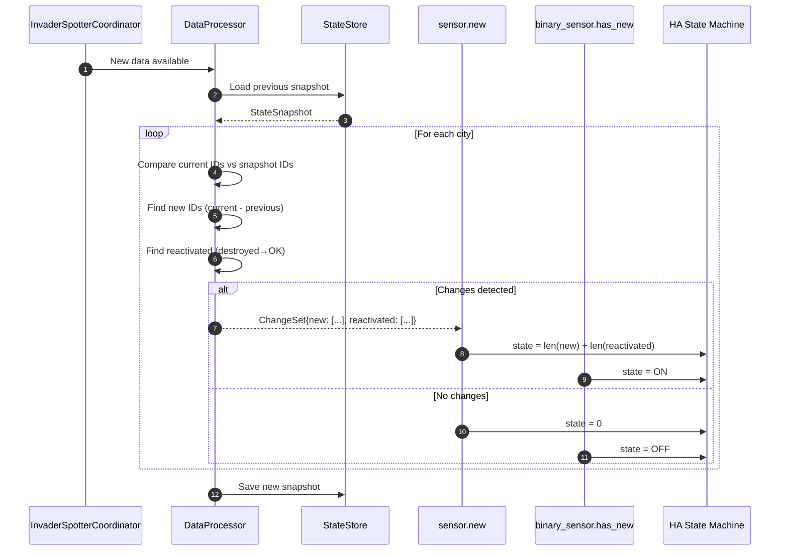

# HA Invader Tracker - Architecture Document

> **Version:** 2.1.1
> **Last Updated:** 2026-04-13
> **Status:** Production Ready
> **Integration Version:** 2.1.1

---

## Table of Contents

1. [Introduction](#1-introduction)
2. [High-Level Architecture](#2-high-level-architecture)
3. [Tech Stack](#3-tech-stack)
4. [Data Models](#4-data-models)
5. [External APIs](#5-external-apis)
6. [Components](#6-components)
7. [Core Workflows](#7-core-workflows)
8. [Project Structure](#8-project-structure)
9. [Development Workflow](#9-development-workflow)
10. [CI/CD & Release](#10-cicd--release)
11. [Security](#11-security)
12. [Error Handling](#12-error-handling)
13. [Monitoring & Logging](#13-monitoring--logging)
14. [Architecture Checklist](#14-architecture-checklist)

---

## 1. Introduction

This document defines the complete architecture for the **HA Invader Tracker** custom integration for Home Assistant. The integration tracks Space Invader street art mosaics by combining data from two sources:

1. **Flash Invader API** (space-invaders.com) - User's personal flashed invaders via UID
2. **Invader-Spotter** (invader-spotter.art) - Community database of all known invaders with status updates

The integration exposes **devices per tracked city** (sensors for new, reactivated, and unflashed invaders) and a **player profile device** (personal score, rank, and followed players) — enabling Home Assistant automations and dashboards for street art hunters.

### Project Type

**HACS Custom Integration** - Python-based, follows Home Assistant Core conventions, distributable via HACS, fully typed and tested.

### Key Features

| Feature | Implementation | Status |
|---------|----------------|--------|
| Multi-city tracking | Config flow with dynamic city discovery | ✅ Complete |
| Flash Invader API polling | Dedicated coordinator with auth handling | ✅ Complete |
| Invader-spotter scraping | Smart caching with fallback + retries | ✅ Complete |
| Change detection | State snapshot comparison | ✅ Complete |
| New/reactivated tracking | News event parsing + status changes | ✅ Complete |
| Device per city | HA Device Registry integration | ✅ Complete |
| News aggregation | Real-time updates from invader-spotter.art | ✅ Complete |
| Player profile device | Score, rank, cities found, invaders found, registration date | ✅ Complete |
| Followed players | One device per followed player with score, rank, invaders found | ✅ Complete |
| Scrape retry logic | Exponential backoff on timeout | ✅ Complete |

---

## 2. High-Level Architecture

### Technical Summary

The HA Invader Tracker is a **polling-based custom integration** built on Home Assistant's `DataUpdateCoordinator` pattern. It maintains two data pipelines: one for scraping the community invader-spotter.art database (configurable: daily to monthly), and another for querying the user's personal Flash Invader data via reverse-engineered API (up to hourly). Data is cross-referenced by invader ID to compute flash status, then exposed as Device entities per tracked city with multiple sensors. All state is persisted locally to enable detection of new/reactivated invaders between updates.

### Architecture Diagram



### Architectural Patterns

| Pattern | Application | Rationale |
|---------|-------------|-----------|
| **DataUpdateCoordinator** | Both data sources | HA-standard for polling; handles rate limiting, error retry, and entity updates automatically |
| **Repository Pattern** | API clients | Abstracts data fetching; enables mocking for tests and future API changes |
| **Observer Pattern** | Entity updates | Coordinators notify entities on data refresh; standard HA pattern |
| **Diff-based State** | New/reactivated detection | Store previous state, compare on update to detect changes |
| **Config Flow** | User setup | UI-based configuration; required for HACS distribution |
| **Device Grouping** | Per-city organization | Groups related sensors; enables per-city enable/disable |

### Data Flow

```
1. Config Flow → User enters UID + selects cities
2. InvaderSpotterCoordinator → Scrapes all invaders for selected cities
3. FlashInvaderCoordinator → Fetches user's flashed invaders
4. Data Processor → Cross-references by ID, computes:
   - total: All invaders in city (from invader-spotter)
   - flashed: Invaders user has flashed (from Flash Invader API)
   - unflashed: total - flashed (where status = OK/flashable)
   - unflashed_gone: total - flashed (where status = destroyed/unflashable)
   - new: Invaders not in previous state snapshot
5. Entities → Expose counts as state, lists as attributes
```

---

## 3. Tech Stack

### Core Technologies

| Category | Technology | Version | Purpose | Rationale |
|----------|------------|---------|---------|-----------|
| **Language** | Python | 3.12+ | Integration code | HA Core requirement (2024.x+) |
| **Framework** | Home Assistant Core | 2024.1+ | Integration platform | Target platform |
| **Async HTTP** | aiohttp | 3.9+ | API calls & scraping | HA's standard async HTTP client |
| **HTML Parsing** | BeautifulSoup4 | 4.12+ | Scrape invader-spotter | Industry standard, handles malformed HTML |
| **Data Validation** | voluptuous | 0.14+ | Config validation | HA's standard validation library |
| **Type Hints** | Python typing | 3.12+ | Type safety | HA code quality requirement |

### Development & Testing

| Category | Technology | Purpose |
|----------|------------|---------|
| **Testing** | pytest + pytest-asyncio | Unit & async tests |
| **Linting** | ruff | Code linting & formatting |
| **Type Checking** | mypy (strict mode) | Static type analysis |

> **Note:** All tool configuration is in `pyproject.toml`. There are no `requirements.txt` or `.pre-commit-config.yaml` files.

### Runtime Dependency (manifest.json)

```json
{
  "requirements": ["beautifulsoup4>=4.12.0"]
}
```

---

## 4. Data Models

### Core Data Structures

```python
from dataclasses import dataclass, field
from datetime import date, datetime
from enum import Enum


class InvaderStatus(Enum):
    """Status from invader-spotter community data."""
    OK = "ok"                    # Intact, flashable
    DAMAGED = "damaged"          # Partially damaged, flashable
    VERY_DAMAGED = "very_damaged"# Heavily damaged, flashable
    DESTROYED = "destroyed"      # Gone, NOT flashable
    NOT_VISIBLE = "not_visible"  # Not visible, NOT flashable
    UNKNOWN = "unknown"          # Unknown, NOT flashable

    # Flashable: OK, DAMAGED, VERY_DAMAGED
    # Not flashable: DESTROYED, NOT_VISIBLE, UNKNOWN


class NewsEventType(Enum):
    """Type of news event from invader-spotter.art."""
    ADDED = "added"
    REACTIVATED = "reactivated"
    RESTORED = "restored"
    DEGRADED = "degraded"
    DESTROYED = "destroyed"
    STATUS_UPDATE = "status_update"
    ALERT = "alert"


@dataclass
class Invader:
    """Represents an invader from invader-spotter.art."""
    id: str                      # e.g., "PA_346", "LYN_042"
    city_code: str               # e.g., "PA", "LYN"
    city_name: str               # e.g., "Paris", "Lyon"
    points: int                  # Point value (10-100)
    status: InvaderStatus        # Current known status
    install_date: date | None = None
    status_date: date | None = None
    status_source: str | None = None

    @property
    def is_flashable(self) -> bool:
        """Can this invader still be flashed?"""
        return self.status in (InvaderStatus.OK, InvaderStatus.DAMAGED, InvaderStatus.VERY_DAMAGED)


@dataclass
class FlashedInvader:
    """Represents an invader the user has flashed."""
    id: str                      # e.g., "PA_346"
    name: str                    # Same as ID typically
    city_id: int                 # Numeric city ID from API
    points: int                  # Points earned
    image_url: str               # URL to invader image
    install_date: date | None = None   # date_pos from API
    flash_date: datetime | None = None # When user flashed it


@dataclass
class NewsEvent:
    """A news event from invader-spotter.art."""
    event_type: NewsEventType
    invader_id: str              # e.g., "PA_1554"
    city_code: str               # e.g., "PA"
    event_date: date
    raw_text: str = ""

    @property
    def is_positive(self) -> bool:
        return self.event_type in (NewsEventType.ADDED, NewsEventType.REACTIVATED, NewsEventType.RESTORED)

    @property
    def is_negative(self) -> bool:
        return self.event_type in (NewsEventType.DESTROYED, NewsEventType.DEGRADED)


@dataclass
class City:
    """Represents a city with invaders."""
    code: str                    # e.g., "PA", "LYN"
    name: str                    # e.g., "Paris", "Lyon"
    country: str = ""            # e.g., "France"
    total_invaders: int = 0      # Count from invader-spotter
    api_city_id: int | None = None  # Numeric ID from Flash Invader API


@dataclass
class CityStats:
    """Computed statistics for a tracked city."""
    city: City
    all_invaders: list[Invader] = field(default_factory=list)
    flashed_invaders: list[FlashedInvader] = field(default_factory=list)
    new_invaders: list[Invader] = field(default_factory=list)
    reactivated_invaders: list[Invader] = field(default_factory=list)
    news_events: list[NewsEvent] = field(default_factory=list)

    @property
    def flashed_ids(self) -> set[str]:
        return {inv.id for inv in self.flashed_invaders}

    @property
    def unflashed(self) -> list[Invader]:
        """Invaders not flashed AND still flashable."""
        return [inv for inv in self.all_invaders
                if inv.id not in self.flashed_ids and inv.is_flashable]

    @property
    def unflashed_gone(self) -> list[Invader]:
        """Invaders not flashed AND no longer flashable (missed)."""
        return [inv for inv in self.all_invaders
                if inv.id not in self.flashed_ids and not inv.is_flashable]

    @property
    def unflashed_new(self) -> list[Invader]:
        """New invaders that are unflashed."""
        return [inv for inv in self.new_invaders if inv.id not in self.flashed_ids]

    @property
    def unflashed_reactivated(self) -> list[Invader]:
        """Reactivated invaders that are unflashed."""
        return [inv for inv in self.reactivated_invaders if inv.id not in self.flashed_ids]

    # Computed count properties: total_count, flashed_count, unflashed_count,
    # unflashed_gone_count, new_count, unflashed_new_count, positive_news_count


@dataclass
class StateSnapshot:
    """Snapshot of state for detecting changes between updates."""
    timestamp: datetime
    invader_ids_by_city: dict[str, set[str]] = field(default_factory=dict)
    status_by_invader: dict[str, InvaderStatus] = field(default_factory=dict)
    first_seen_date: dict[str, datetime] = field(default_factory=dict)
    previous_status: dict[str, InvaderStatus] = field(default_factory=dict)

    def get_new_invaders(self, city_code: str, current_ids: set[str]) -> set[str]:
        """Return IDs that are in current but not in snapshot."""
        previous = self.invader_ids_by_city.get(city_code, set())
        return current_ids - previous

    def get_recently_added(self, current_invaders: list[Invader], days: int = 30) -> list[Invader]:
        """Return invaders first seen within the given number of days."""
        ...

    def get_reactivated(self, current_invaders: list[Invader]) -> list[Invader]:
        """Return invaders whose status changed from destroyed/not_visible to flashable."""
        ...

    def was_previously_destroyed(self, invader_id: str) -> bool:
        """Check if an invader was previously in destroyed/not_visible state."""
        ...


@dataclass
class ChangeSet:
    """Result of change detection between updates."""
    new_invaders: list[Invader] = field(default_factory=list)
    reactivated_invaders: list[Invader] = field(default_factory=list)
    newly_destroyed: list[Invader] = field(default_factory=list)
```

### Data Relationships



---

## 5. External APIs

### Flash Invader API (space-invaders.com)

**Purpose:** Retrieve the user's personal list of flashed invaders

| Property | Value |
|----------|-------|
| **Base URL** | `https://api.space-invaders.com` |
| **Documentation** | None (reverse-engineered) |
| **Authentication** | UID header (UUID format) |
| **Rate Limits** | Unknown (assume conservative: 24 req/day safe) |

#### Endpoint: Get User's Flashed Invaders

```http
GET /flashinvaders_v3_pas_trop_predictif/api/gallery?uid={user_uid} HTTP/1.1
Host: api.space-invaders.com
Accept: */*
Origin: https://pnote.eu
Referer: https://pnote.eu/
```

#### Response Format

```json
{
  "invaders": {
    "PA_346": {
      "image_url": "https://space-invaders.com/media/invaders/paris/PA_346-276F6UKS.jpg",
      "point": 20,
      "city_id": 1,
      "name": "PA_346",
      "space_id": 346,
      "date_pos": "2000-10-01",
      "date_flash": "2025-02-08 17:18:20"
    }
  }
}
```

#### Field Mapping

| API Field | Data Model Field | Type |
|-----------|------------------|------|
| `key` (dict key) | `FlashedInvader.id` | string |
| `name` | `FlashedInvader.name` | string |
| `city_id` | `FlashedInvader.city_id` | int |
| `point` | `FlashedInvader.points` | int |
| `image_url` | `FlashedInvader.image_url` | string |
| `date_pos` | `FlashedInvader.install_date` | date |
| `date_flash` | `FlashedInvader.flash_date` | datetime |

### Invader-Spotter (invader-spotter.art)

**Purpose:** Scrape community database of all known invaders with status

| Property | Value |
|----------|-------|
| **Base URL** | `https://www.invader-spotter.art` |
| **Documentation** | None (HTML scraping) |
| **Authentication** | None required |
| **Rate Limits** | Be respectful - max 1 full scrape/day |

#### Endpoints

- **Cities List:** `GET /villes.php`
- **City Invaders:** `POST /listing.php` (paginated, form data with city code)
- **News Feed:** `GET /news.php` (recent events: additions, reactivations, destructions)

#### HTML Structure to Parse

```html
<div class="invader">
  <a href="invader.php?id=BRL_01">BRL_01</a> [20 pts]<br>
  Date de pose : 10/05/2002<br>
  Dernier état connu : <span class="status-ok">OK</span><br>
  Date et source : août 2018 (spott)<br>
</div>
```

#### Status Mapping

| French Text | InvaderStatus | Flashable |
|-------------|---------------|-----------|
| `OK` / `intact` | `OK` | Yes |
| `dégradé` / `un peu dégradé` | `DAMAGED` | Yes |
| `très dégradé` | `VERY_DAMAGED` | Yes |
| `détruit` / `détruit !` / `disparu` | `DESTROYED` | No |
| `non visible` | `NOT_VISIBLE` | No |
| `inconnu` / missing | `UNKNOWN` | No |

#### News Event Mapping

| French Keyword | NewsEventType |
|----------------|---------------|
| `ajout` | `ADDED` |
| `réactivation` | `REACTIVATED` |
| `restauration` | `RESTORED` |
| `dégradation` | `DEGRADED` |
| `destruction` | `DESTROYED` |
| `mise à jour` | `STATUS_UPDATE` |
| `alerte` | `ALERT` |

---

## 6. Components

### Component Diagram



### Component Responsibilities

| Component | File | Responsibility |
|-----------|------|----------------|
| **ConfigFlow** | `config_flow.py` | User setup wizard (UID + city selection) |
| **OptionsFlow** | `config_flow.py` | Reconfigure cities/intervals/news days |
| **InvaderSpotterCoordinator** | `coordinator.py` | Periodic scraping with per-city caching and news caching (6h TTL) |
| **FlashInvaderCoordinator** | `coordinator.py` | Periodic Flash Invader API calls with city grouping |
| **FlashInvaderAPI** | `api/flash_invader.py` | API client for api.space-invaders.com |
| **InvaderSpotterScraper** | `api/invader_spotter.py` | HTML scraper for invader-spotter.art (cities, invaders with pagination, news) |
| **DataProcessor** | `processor.py` | Cross-reference data, compute stats, detect changes via news + snapshots |
| **StateStore** | `store.py` | Persist state snapshots to HA `.storage/` directory |
| **InvaderSensor** | `sensor.py` | 6 sensor entities per city (total, flashed, unflashed, unflashed_gone, new, to_flash) |
| **InvaderBinarySensor** | `binary_sensor.py` | Binary sensor per city (has_new trigger) |

> **Note:** Device info is integrated directly into sensor and binary sensor entities via `DeviceInfo` properties. There is no separate `device.py` file.

---

## 7. Core Workflows

### Initial Setup (Config Flow)



### Scheduled Data Refresh



### New Invader Detection



---

## 8. Project Structure

```
ha-invader-tracker/
├── .github/
│   └── workflows/
│       ├── ci.yml                     # Lint, type-check, test on push/PR
│       ├── hacs.yml                   # HACS validation on push/PR
│       └── release.yml                # Build zip & publish on release
│
├── custom_components/
│   └── invader_tracker/
│       ├── __init__.py                # Integration setup & lifecycle
│       ├── manifest.json              # HA + HACS metadata (v1.3.3)
│       ├── const.py                   # Constants, defaults, keys
│       ├── config_flow.py             # UI configuration wizard (setup + options + reauth)
│       ├── coordinator.py             # DataUpdateCoordinators (spotter + flash)
│       ├── processor.py               # Data cross-referencing & change detection
│       ├── store.py                   # State persistence to HA .storage/
│       ├── sensor.py                  # 6 sensor entities per city
│       ├── binary_sensor.py           # 1 binary sensor per city
│       ├── models.py                  # Data models (dataclasses + enums)
│       ├── exceptions.py              # Custom exception hierarchy
│       ├── icon.png                   # Integration icon
│       ├── api/
│       │   ├── __init__.py            # Exports FlashInvaderAPI, InvaderSpotterScraper
│       │   ├── flash_invader.py       # Flash Invader API client
│       │   └── invader_spotter.py     # Invader-Spotter scraper (cities, invaders, news)
│       ├── strings.json               # UI strings reference
│       └── translations/
│           ├── en.json                # English translations
│           └── fr.json                # French translations
│
├── tests/
│   ├── __init__.py
│   ├── conftest.py                    # Pytest fixtures (config entry, mock data)
│   ├── test_models.py                 # Data model unit tests
│   └── test_device_removal.py         # City removal / device registry tests
│
├── docs/
│   └── architecture.md                # This document
│
├── .gitignore
├── hacs.json                          # HACS distribution config
├── LICENSE                            # MIT
├── README.md
├── CHANGELOG.md                       # Version history
├── CONTRIBUTING.md                    # Contributor guidelines
├── DOCUMENTATION.md                   # Detailed user documentation
├── INSTALL.md                         # Installation guide
├── QUICK_REFERENCE.md                 # Quick reference
└── pyproject.toml                     # Ruff, MyPy, Pytest config
```

---

## 9. Development Workflow

### Initial Setup

```bash
# Clone repository
git clone https://github.com/Trolent/HA-Invader-Tracker.git
cd HA-Invader-Tracker

# Create virtual environment
python -m venv venv
source venv/bin/activate

# Install dev tools (configured in pyproject.toml)
pip install ruff mypy pytest pytest-asyncio
pip install beautifulsoup4>=4.12.0
```

### Development Commands

```bash
# Linting
ruff check .
ruff format --check .

# Type checking
mypy custom_components/invader_tracker

# Run tests
pytest

# Run tests with coverage
pytest --cov=custom_components/invader_tracker --cov-report=html

# Format code
ruff format .
ruff check --fix .
```

### Local Testing with Home Assistant

```bash
# Symlink to HA installation
ln -s $(pwd)/custom_components/invader_tracker \
      ~/.homeassistant/custom_components/invader_tracker

# Or use Docker
docker run -d \
  -v $(pwd)/custom_components:/config/custom_components \
  -p 8123:8123 \
  homeassistant/home-assistant:latest
```

---

## 10. CI/CD & Release

### GitHub Actions Workflows

#### CI Pipeline (`.github/workflows/ci.yml`)

Triggered on `push` and `pull_request` to `main`:

| Job | Tools | Purpose |
|-----|-------|---------|
| **Lint & Format** | ruff | Check code style and formatting |
| **Type Check** | mypy | Static type analysis (strict mode) |
| **Tests** | pytest + pytest-cov | Run test suite with coverage report |

#### HACS Validation (`.github/workflows/hacs.yml`)

Triggered on `push` and `pull_request` to `main`:
- Validates integration structure against HACS requirements using `hacs/action@main`

#### Release Pipeline (`.github/workflows/release.yml`)

Triggered on `release` event (type: `published`):
1. Checkout code
2. Create zip: `cd custom_components/invader_tracker && zip -r ../../invader_tracker.zip .`
3. Upload zip to GitHub release via `softprops/action-gh-release@v2`

### Release Process

```bash
# Update version in manifest.json and hacs.json
# Commit and push
git add custom_components/invader_tracker/manifest.json hacs.json
git commit -m "Bump version to X.Y.Z"
git push origin main

# Create a GitHub Release via the UI or CLI
gh release create vX.Y.Z --title "vX.Y.Z" --notes "Release notes here"

# GitHub Actions automatically builds and attaches the zip
```

---

## 11. Security

### Credential Management

- **UID Storage:** Stored in HA's ConfigEntry (encrypted at rest on HA OS)
- **UID in Transit:** Sent via HTTPS query parameter only
- **UID Logging:** Never logged, never in entity attributes

### Security Checklist

| Category | Check | Status |
|----------|-------|--------|
| **Credentials** | UID stored in ConfigEntry | ✅ |
| **Credentials** | UID never logged | ✅ |
| **Network** | All requests over HTTPS | ✅ |
| **Network** | SSL verification enabled | ✅ |
| **Input** | UID format validated | ✅ |
| **Input** | City codes validated | ✅ |
| **Rate Limiting** | Self-imposed delays | ✅ |

---

## 12. Error Handling

### Exception Hierarchy

```python
class InvaderTrackerError(Exception):
    """Base exception."""

class AuthenticationError(InvaderTrackerError):
    """UID invalid or expired."""

class InvaderTrackerConnectionError(InvaderTrackerError):
    """Network connection failed."""

class FlashInvaderConnectionError(InvaderTrackerConnectionError):
    """Flash Invader API connection failed."""

class InvaderSpotterConnectionError(InvaderTrackerConnectionError):
    """Invader Spotter connection failed."""

class DataError(InvaderTrackerError):
    """Base for data-related errors."""

class ParseError(DataError):
    """Failed to parse response."""

class InvalidResponseError(DataError):
    """Unexpected response format."""

class RateLimitError(InvaderTrackerError):
    """Rate limited by external service (has retry_after property)."""
```

### Error Recovery Strategies

| Error Type | Recovery Strategy | User Impact |
|------------|-------------------|-------------|
| **Auth Failed** | Trigger reauth flow | Notification |
| **Rate Limited** | Exponential backoff | Temporary unavailable |
| **Connection Timeout** | Retry next interval | Use cached data |
| **Parse Error (partial)** | Skip bad entries | Slightly stale data |
| **All Cities Failed** | Mark unavailable | Entities unavailable |

---

## 13. Monitoring & Logging

### Enable Debug Logging

```yaml
# configuration.yaml
logger:
  default: warning
  logs:
    custom_components.invader_tracker: debug
```

> **Note:** Dedicated diagnostic sensors and health check services are not yet implemented. Monitoring is currently done via standard HA coordinator availability states and debug logging.

---

## 14. Architecture Checklist

### Requirements Traceability

| Requirement | Status |
|-------------|--------|
| Scrape invader-spotter.art (configurable interval) | ✅ |
| Use personal UID for Flash Invader API | ✅ |
| Track new/reactivated invaders | ✅ |
| Track unflashed invaders (flashable) | ✅ |
| Track unflashed invaders (gone) | ✅ |
| Filter by city in settings | ✅ |
| Device per city | ✅ |
| Expose as HA entities (6 sensors + 1 binary per city) | ✅ |
| News event parsing (additions, reactivations, destructions) | ✅ |
| "Invaders To Flash" text sensor | ✅ |
| Reauth flow on credential failure | ✅ |
| Bilingual support (EN/FR) | ✅ |
| HACS distributable | ✅ |

### Entity Summary

| Entity Pattern | Type | Icon | State | Key Attributes |
|----------------|------|------|-------|----------------|
| `sensor.{city}_total` | Sensor | `mdi:space-invaders` | Count | `invader_ids`, `flashable_count` |
| `sensor.{city}_flashed` | Sensor | `mdi:check-circle` | Count | List of `{id, points, flash_date}`, `total_points` |
| `sensor.{city}_unflashed` | Sensor | `mdi:crosshairs-question` | Count | List of `{id, points, status}`, `total_points` |
| `sensor.{city}_unflashed_gone` | Sensor | `mdi:ghost-off` | Count | List of `{id, points, status}`, `missed_points` |
| `sensor.{city}_new` | Sensor | `mdi:new-box` | Count | `new_invaders`, `reactivated_invaders`, `potential_points` |
| `sensor.{city}_to_flash` | Sensor | `mdi:format-list-bulleted` | CSV list of IDs | `new_ids`, `reactivated_ids`, `potential_points` |
| `binary_sensor.{city}_has_new` | Binary | `mdi:alert-decagram` | ON/OFF | `new_count`, `reactivated_count`, `total_new` |

### Implementation Status

| Phase | Components | Status |
|-------|------------|--------|
| **Phase 1: Core** | Models, API clients, coordinators | ✅ Complete |
| **Phase 2: Integration** | Config flow, entities, device info | ✅ Complete |
| **Phase 3: Processing** | DataProcessor, StateStore, news events | ✅ Complete |
| **Phase 4: Polish** | Translations (EN/FR), error handling | ✅ Complete |
| **Phase 5: Release** | Release workflow, HACS distribution | ✅ Complete |
| **Phase 6: Testing** | Comprehensive test suite, CI pipeline | Partial (models + device removal tests; CI pipeline added) |

---

## Appendix: Configuration Reference

### manifest.json

```json
{
  "domain": "invader_tracker",
  "name": "Invader Tracker",
  "codeowners": [],
  "config_flow": true,
  "dependencies": [],
  "documentation": "https://github.com/Trolent/ha-invader-tracker",
  "iot_class": "cloud_polling",
  "issue_tracker": "https://github.com/Trolent/ha-invader-tracker/issues",
  "requirements": ["beautifulsoup4>=4.12.0"],
  "version": "1.3.3"
}
```

### hacs.json

```json
{
  "name": "Invader Tracker",
  "homeassistant": "2024.1.0",
  "render_readme": true,
  "zip_release": true,
  "filename": "invader_tracker.zip"
}
```

### pyproject.toml (tool configuration)

```toml
[project]
name = "ha-invader-tracker"
version = "1.0.0"
requires-python = ">=3.12"
license = "MIT"

[tool.ruff]
target-version = "py312"
line-length = 100

[tool.ruff.lint]
select = ["E", "W", "F", "I", "UP", "B", "C4", "ASYNC", "BLE"]
ignore = ["E501"]

[tool.mypy]
python_version = "3.12"
strict = true
ignore_missing_imports = true

[tool.pytest.ini_options]
testpaths = ["tests"]
asyncio_mode = "auto"
```

---

## 15. Recent Improvements (v1.3.x)

### Code Quality (Jan 2026)

- Replaced empty `pass` in `TYPE_CHECKING` blocks with actual type imports
- Fixed `TimeoutError` -> `asyncio.TimeoutError` in async API clients
- Removed unused loop variables, fixed variable shadowing
- Made `install_date` and `flash_date` optional in `FlashedInvader` (prevents crashes on malformed API data)
- Improved date parsing: returns `None` instead of silent fallback to `datetime.now()`
- Fixed test mock paths to patch correct import locations
- Trailing whitespace cleanup across all files

### Caching & Performance

- Per-city data cache with configurable interval (default: 24h)
- News events cached with 6-hour TTL
- Fallback to expired cache during API failures
- Rate limiting: 2s delay between city scrapes, 0.5s between pages
- Polite retry with exponential backoff

---

## 16. Future Roadmap

### Potential Enhancements

- [ ] Database backend for historical tracking
- [ ] Statistics dashboard card
- [ ] Photo gallery of flashed invaders
- [ ] Location mapping with coordinates
- [ ] Nearby invaders search radius
- [ ] Mobile app companion features
- [ ] Cloud sync capabilities
- [ ] Achievements/badges system

### API Stability

Both data sources are actively maintained:
- **invader-spotter.art** - Community-driven, stable
- **Flash Invader API** - Official app API, stable

The integration is designed to handle minor API changes gracefully through error handling and fallback mechanisms.

---

## 17. Getting Help

### Resources

- **GitHub Issues:** [Trolent/HA-Invader-Tracker/issues](https://github.com/Trolent/HA-Invader-Tracker/issues)
- **Home Assistant Community:** [Community Forums](https://community.home-assistant.io/)
- **Debug Logs:** Enable debug logging for detailed troubleshooting

### Development

To contribute or extend the integration:

1. Check existing architecture documentation
2. Review code style in `pyproject.toml`
3. Run tests: `pytest tests/`
4. Submit pull requests with clear descriptions

---

**Document History:**
- v2.0.0 (Jan 27, 2026) - Aligned with actual codebase: fixed models, components, project structure, API details, exception hierarchy, entity summary. Added NewsEvent, ChangeSet, news mapping.
- v1.1.0 (Jan 26, 2026) - Added recent improvements, expanded documentation
- v1.0.0 (Jan 23, 2026) - Initial architecture document

*Document maintained by Winston, BMAD Architect Agent*
